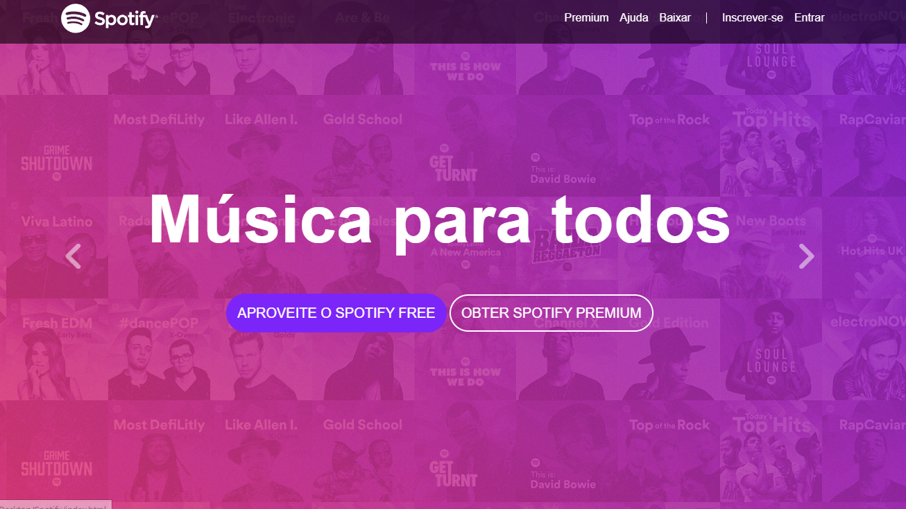

<h1 align="center"> Spotify </h1>

Site fictício do spotify

Preview da página inicial (Zoom: 100%)

[Clique AQUI para acessar](https://nepht022.github.io/Spotify/)

## Ferramentas

- HTML
- CSS
- FontAwesome
- Bootstrap
- Git
- Github
